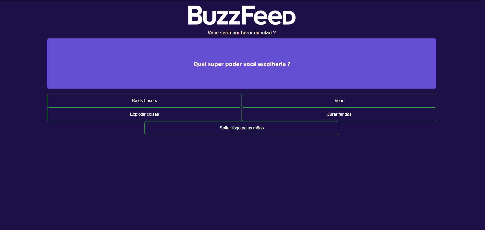

# BuzzFeed Clone (Angular) — Projeto Acadêmico

Um clone minimalista do BuzzFeed, feito com **Angular**, focado em praticar conceitos do framework e lógica de aplicação.  
A ideia principal é simular a experiência de **quiz** (perguntas + respostas) e exibir um **resultado final** com base nas escolhas do usuário.

---

## 🎯 Objetivo do projeto

Este projeto tem como objetivo **aprender e fixar** fundamentos do Angular, como:

- Componentes e organização de projeto
- Diretivas (`*ngIf`, `*ngFor`)
- Estruturação de dados para perguntas/respostas
- Lógica de cálculo do resultado do quiz

---

## ✅ Funcionalidades

- Exibição de perguntas e alternativas
- Seleção de respostas pelo usuário
- Cálculo do resultado baseado nas escolhas
- Exibição do resultado final ao terminar o quiz

---

## 🧱 Tecnologias

- Angular
- TypeScript
- HTML
- CSS

---

## ▶️ Como rodar o projeto

### Pré-requisitos

- Node.js instalado
- Angular CLI instalado

### Instalação

```bash
npm install
```

### Executar em desenvolvimento

```bash
ng serve
```

Depois acesse:

- http://localhost:4200/

---

## 📁 Estrutura

A estrutura pode variar, mas normalmente segue algo parecido com:

- `src/app/components/` → componentes do quiz
- `src/assets/data/` → arquivo com as perguntas/respostas (mock)
- `src/assets/` → imagens e recursos

---

## 🧠 Como funciona a lógica do resultado (resumo)

Uma forma simples de calcular o resultado é:

- Cada alternativa aponta para um “tipo”/categoria (ex.: `A`, `B`, `C`)
- Ao final, o sistema conta qual categoria apareceu mais
- O resultado exibido é o **mais escolhido**

---

## 📷 Preview



---

## 👤 Autor

**Tulio Castro**  
LinkedIn: <https://www.linkedin.com/in/tulio-perdigao/>  
GitHub: <https://github.com/tulioperdigao>


